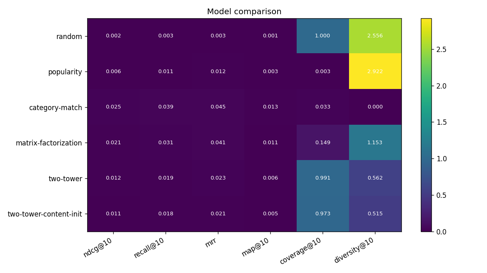
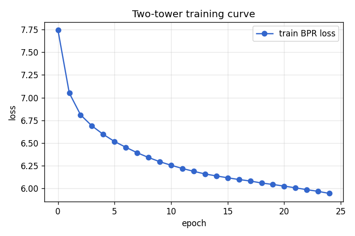
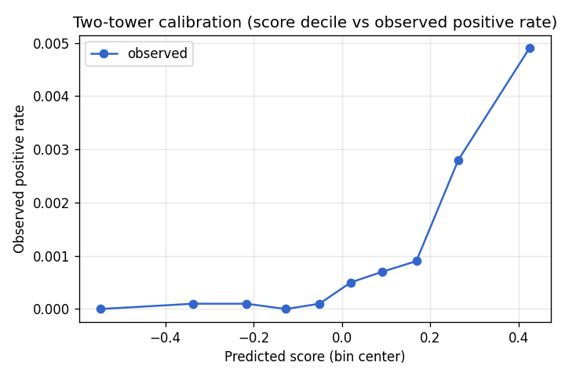

# Donation Platform Recommender — Benchmark Report

- Generated: `2026-05-25T22:23:50.333547+00:00`
- Git SHA: `e0ea105`
- Org corpus snapshot: `2026-05-24`
- Seed: `42`
- Runtime: `99.64s` on `macOS-26.5-x86_64-i386-64bit` / Python `3.11.12`
- Mode: `full`

## Dataset

- Orgs: `3,000` (sampled across all NTEE major categories, sourced from ProPublica Nonprofit Explorer)
- Synthetic users: `8,000`
- Synthetic donation events: `112,566` (train `72,352` / val `17,506` / test `22,708`)

## Headline comparison

Metrics are mean-over-users. Higher is better for ranking metrics; higher = more diverse for diversity@10.

| Model | ndcg@10 | recall@10 | mrr | map@10 | coverage@10 | diversity@10 | cold_user_ndcg@10 | cold_user_recall@10 | cold_org_recall@10 | fit_seconds |
|---|---|---|---|---|---|---|---|---|---|---|
| random | 0.0015 | 0.0026 | 0.0033 | 0.0007 | 1.0000 | 2.5559 | 0.0005 | 0.0015 | 0.0000 | 0.0000 |
| popularity | 0.0064 | 0.0105 | 0.0119 | 0.0031 | 0.0033 | 2.9219 | 0.0074 | 0.0149 | 0.0000 | 0.0000 |
| category-match | 0.0255 | 0.0392 | 0.0449 | 0.0129 | 0.0333 | 0.0000 | 0.0158 | 0.0327 | 0.0000 | 0.7200 |
| matrix-factorization | 0.0212 | 0.0310 | 0.0406 | 0.0107 | 0.1493 | 1.1531 | 0.0085 | 0.0193 | 0.0000 | 10.3500 |
| two-tower | 0.0120 | 0.0193 | 0.0231 | 0.0059 | 0.9913 | 0.5621 | 0.0113 | 0.0208 | 0.1667 | 41.5400 |
| two-tower-content-init | 0.0109 | 0.0178 | 0.0211 | 0.0053 | 0.9730 | 0.5146 | 0.0104 | 0.0208 | 0.0833 | 35.1900 |

## Invariant tests

| Invariant | Status | Score | Threshold | Notes |
|---|---|---|---|---|
| category-locked | ✅ PASS | 0.9992 | 0.4000 | mean fraction of top-10 in the user's locked category |
| diversity-floor | ❌ FAIL | 1.0000 | 0.9500 | worst single-category share of any user's top-10; threshold=0.95 |
| beats-random | ✅ PASS | 0.0105 | 0.0015 | two-tower ndcg@10=0.0120 vs random ndcg@10=0.0015; require >2x |

## Centerpiece plots

- 
- 

## Reproducibility

- Run `make bench` from a clean checkout. Fixed seeds. Same git SHA = same numbers (up to floating-point determinism on CPU).
- `make bench-fast` runs a tiny version in <30 seconds for CI smoke-testing.
- `make bench-ablations` runs the 3×3×2 hyperparam sweep separately (~1 hr).

See `bench/README.md` for the honesty footer and data provenance.